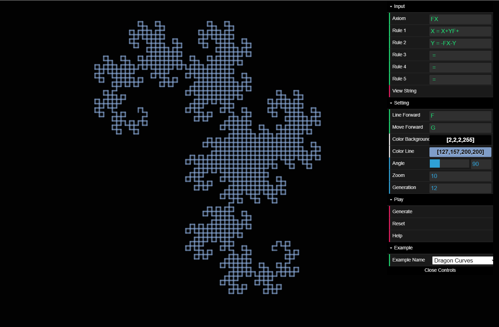

# L-system

more information : https://en.wikipedia.org/wiki/L-system
youtube          : https://www.youtube.com/watch?v=E1B4UoSQMFw

L-System simulation in p5js

[Demo](https://hoangtran0410.github.io/p5js-playground/2018/l-system/)

Original repo: L-system-dat.gui (*DELETED*)
+ Total commits: 5
+ Last commit: 17-03-2018

## Screenshots

