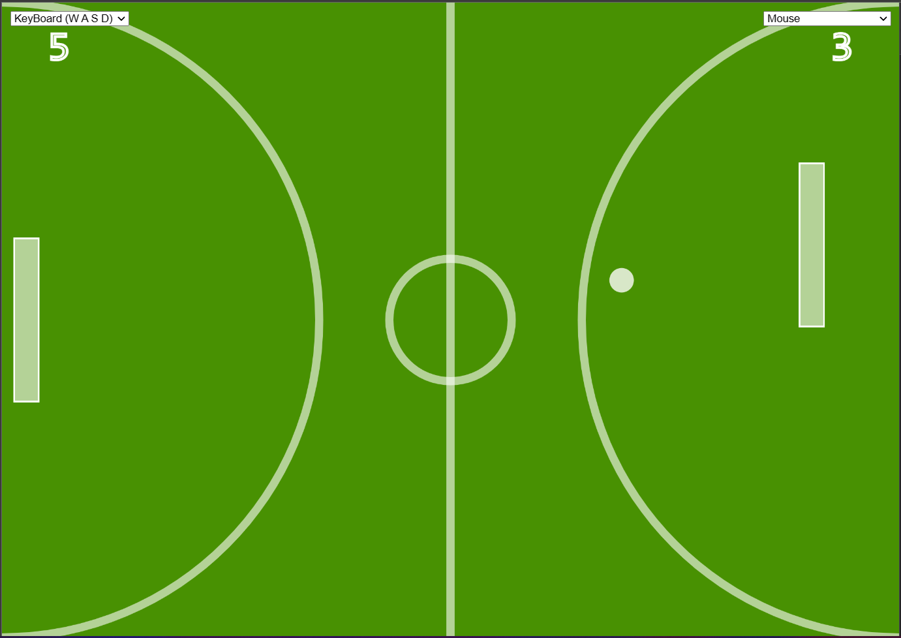
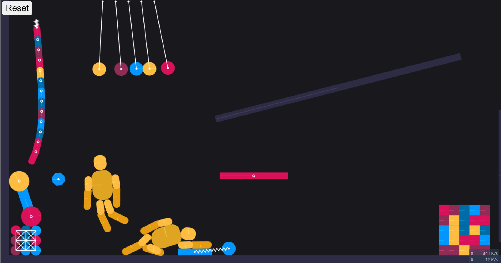

# Matterjs in p5js

### Demo link

1. [Pong Soccer](https://hoangtran0410.github.io/p5js-playground/2019/matter-js/pong/)
    - 

2. [MatterJS playground](https://hoangtran0410.github.io/p5js-playground/2019/matter-js/matterjs-playground/)
    - 

3. [Plinko](https://hoangtran0410.github.io/p5js-playground/2019/matter-js/plinko)
    - 

Original repo: Collision (*DELETED*)
+ Created: 28-12-2018
+ Total commits: 39
+ Last commit: 15-08-2019